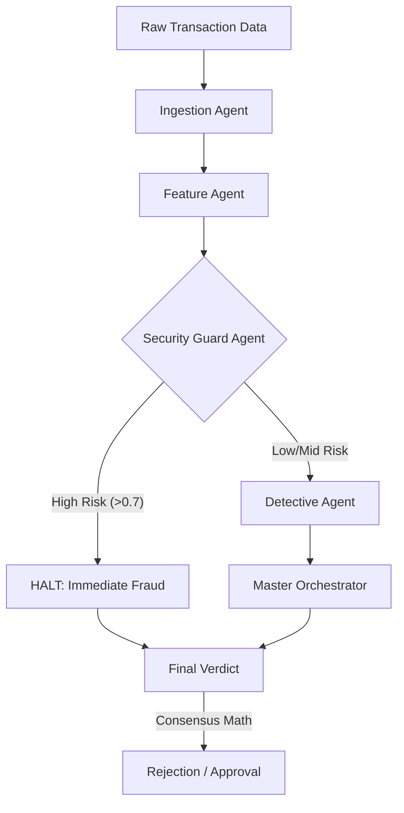

# System Workflow Documentation

This document provides a detailed technical breakdown of the Agentic Fraud Pattern Detector's architecture and operational workflow.

## 🏗️ System Architecture

The project is built on an **Agentic Pipeline** where autonomous agents handle specialized tasks. The system uses a "Consensus-Based Decision" model to balance speed (rule-based) and intelligence (ML-based).

### Operational Flow Diagram

---

## 🤖 Agent Roles

### 1. Ingestion Agent
- **Role**: Data Validator.
- **Responsibility**: Ensures input dictionaries or CSV rows match the expected schema for the pipeline.
- **Output**: Cleaned DataFrame of raw features.

### 2. Feature Agent
- **Role**: Data Scientist.
- **Responsibility**: Performs transformations like:
  - Extracting `hour` from time.
  - Normalizing amounts.
  - Converting categorical payment methods into numerical indicators.
- **Output**: Transformed feature set ready for ML analysis.

### 3. Security Guard Agent (Rules Layer)
- **Role**: First Responder.
- **Logic**: Uses deterministic if/else rules for known fraud triggers.
- **Factors**:
  - `High Amount`: Transactions > $1000.
  - `Security Check`: CVV mismatch on card payments.
  - `Geographic`: Distance from home > 1000km.
  - `Suspicious Window`: Transaction between 1 AM - 4 AM.
- **Score**: 0 to 1.0.

### 4. Detective Agent (ML Layer)
- **Role**: Pattern Recognition Specialist.
- **Logic**: Uses a **Random Forest Classifier** trained on historical fraudulent behaviors.
- **Power**: Catches non-linear fraud patterns that rules might miss (e.g., a specific category + moderate amount + certain time of day).
- **Score**: Probability from 0% to 100%.

---

## 🧠 Decision Logic (The Waterfall)

The system doesn't just average the scores; it uses a **priority waterfall**:

1.  **Security Override**: If the Security Agent flags the transaction as extremely high risk (>0.7), the system halts immediately to save processing power and time.
2.  **Consensus Bridge**: If the risk is moderate (0.3 - 0.7), the system calculates a weighted average: `(0.2 * Security Score) + (0.8 * Detective Score)`.
3.  **AI Lead**: If the transaction passes the rules easily, the Detective Agent's ML prediction takes the lead for the final assessment.

---

## 🛠️ Data Governance
The system uses `advanced_fraud_data.csv` for initial training and `adversarial_test_data.csv` (containing "sneaky" fraud attempts) to verify that the agents haven't become "blind" to new patterns.
